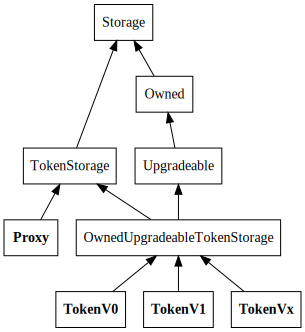

# erc20

## Basic version

Code is in the [basic](./basic) subdirectory.

[a basic solidity contract](basic/basic_contract.sol), and [basic proxy contract](basic/proxy_contract.sol) +
compiled files in the contract subdirectory.

## Extended version

Code is in the [extended](./extended) subdirectory

This is a more advanced setup which separates the storage for the ERC20 token from the conctract logic. As such,
the storage model can be reused by both the proxy and the implementations. Although there are multiple different
contracts here, the only 2 which actually matter are the [basic token contract](./extended/basic_contract.sol) and
the [token proxy](./extended/token_proxy.sol) contracts.

## Proxy Contract setup
 
### motivation

Ethereum contracts are autonomous immutable code. Once deployed to the Ethereum blockchain though, they are essentially set in stone. This means that if a serious bug or issue appears and your contracts aren’t designed in a way that will allow them to be upgraded in your Dapp seamlessly, we're screwed.

To  solve this we make two main design choices:
- All main contracts must be upgradable
- Have a flexible, yet simple way to store data permanently

### Setup

The problem with a contract proxy is that the proxy does not actually call the implementing contract. Instead,
it loads the function code and executes it in it's own storage space. This means that the storage needs to be
defined in the proxy as well, and the storage layout needs to be the same.

The two main contracts here are TokenProxy  and tokenV0..Vx

**tokenV0..Vx** are the actual upgradeable implementations

**Proxy** is the contract that will be called by the users. It delegates all calls to the current tokenV0..Vx implementation. The method are not defined here , every call it receives is delegated so if the implementation adds functionality, this contract does not have to be upgraded.
This way , the address of the deployed TokenProxy never changes.

helper contracts:
+ Storage defines the storage layout
+ TokenStorage exposes storage helpers for the erc20 token (balances, allowances, ...). It also has the token constructor which sets some general variables (name, precision, ...)
+ Proxy provides the functionality to delegate any unknown method to an embedded contract address
+ Owned alllows us to have the notion of "owners", and adds a modifier to methods which ensures that only addresses in the owner list can call them.
+ Upgradeable adds the upgrade logic, and stores the address and version of the currently used token contract. Note that this contract is only extended from by the tokens,
    even though these do not use the upgrade logic themselves. This way the proxy does not need to be aware of the actual token upgrade logic, which allows the upgrade logic itself
    to be upgradeable.
+ OwnedUpgradeableTokenStorage extends from Upgradeable and TokenStorage. This includes all the required components
  for the owned, upgradeable token. (No actual implementation, only inheritence)
  The specific token contracts extend from OwnedTokenStorage, so they all have the same memory structure

### Important

There is only a single contract which actually defines a storage layout: `Storage`. All other contracts which inherit from this and have
their own storage requirements actually use getters and setters which access the storage. The storage structure is defined as a key-value store
for all available primitive types. The key is defined as a `bytes32` type, in practice we use a `keccak256` hash.

### Deployment

There are 2 main contracts which need to be deployed: `Proxy` and the actual token implementation (`TokenV0`). The token contract needs to be deployed first, so the `Proxy`
constructor can set the initial address of said contract. After that, contract upgrades can be done by using the `upgradeTo` method which is inheritted by the actual Token. Once the
`Proxy` has been deployed, new owners can also be added to it (also via proxied calls to the `Token` contract), who will be allowed to add other owners, change the `Token` contract,
and call protected methods on said contract.

## Building and deployment

In both the basic and extended folders a `compile.sh` script is present to compile the contracts.

The solidity compiler (`solc`) is required. :
- Mac osx: `brew install solidity`  